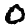

# mnist-diffusion
<picture>
    <source media="(prefers-color-scheme: dark)" srcset="./assets/sample_dark.gif">
    <source media="(prefers-color-scheme: light)" srcset="./assets/sample_light.gif">
    
</picture>

This is a very minimal implementation of a Denoising Diffusion Probabilistic Model (DDPM) with class guidance demoed on the MNIST dataset. 

At training time, random noise is added to the input images and the model is trained to predict the noise (and consequently denoise the image). Specifically, given the input $x_0$ of class $y$, The noisy image $x_t$ is generated by the following process:

$$x_t := \sqrt{\alpha_t}x_0 + \sqrt{1 - \alpha_t} \varepsilon$$

Where $t \in \{1, 2, \ldots, T\}$ is the "time step". The noise $\varepsilon$ is sampled from a standard normal distribution. The $\alpha_t$ is a schedule that starts at 1 and decays to 0. The model is trained to predict the noise $\varepsilon$ given the noisy image $x_t$, the time step $t$, and the class label $y$.

We also provide the model with the time step $t$ and class label $y$ through learned embeddings at the U-Net bottleneck. Embdedings are generated for $t$ and one-hot endcoded $y$, resized, and concatenated to the bottleneck features. During training the class embeddings are dropped with some probability so that the model learns to sample images from the distribution without guidance as well. This allows us to adjust the output distribution at inference time by the $w$ term in the following formula:

$$\hat{\varepsilon} = (1 + w) \cdot \theta(t, c) - w \cdot \theta(t)$$

By adjusting $w$ we can control the class guidance and consequently the trade-off between the Fréchet Inception Distance and the Inception Score. Essentially a large $w$ will make the outputs adhere more to the modes of the training data, while a small $w$ will allow the model to generate more diverse samples.

To sample an image from the model, we start with a random noise $\varepsilon$ and class label $y$, and iteratively predict the noise for each time step $t$ from T to 1, subtracting the predicted noise from the image at each step.

## References
- [Denoising Diffusion Probabilistic Models](https://arxiv.org/abs/2006.11239)
- [Classifier-Free Diffusion Guidance](https://arxiv.org/abs/2207.12598)
- [Guidance: a cheat code for diffusion models](https://sander.ai/2022/05/26/guidance.html)
- [An In-Depth Guide to Denoising Diffusion Probabilistic Models DDPM](https://learnopencv.com/denoising-diffusion-probabilistic-models/)
- [minDiffusion](https://github.com/cloneofsimo/minDiffusion)